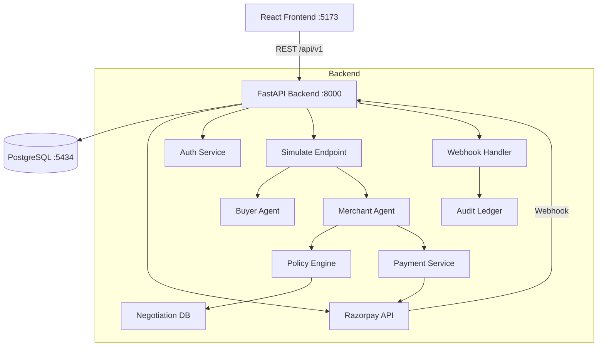

# Merchant Agent OS

An autonomous AI-to-AI commerce platform where a **Buyer Agent** and a **Merchant Agent** negotiate deals in real time, enforce policy rules deterministically, process payments via Razorpay, and maintain a tamper-evident audit ledger — all without human intervention unless escalation is required.

---

## Problem / Solution

**Problem:** B2B procurement involves repetitive, rule-bound negotiations that consume human time. Approval bottlenecks slow deals. Payment initiation is manual.

**Solution:** Merchant Agent OS automates the full commerce loop — from offer to payment — using AI agents constrained by a deterministic policy engine. Humans only intervene when deals exceed policy thresholds.

---

## Key Features

- AI-to-AI negotiation (OpenAI-powered Buyer + Merchant agents)
- Deterministic policy engine (discount, margin, quantity, amount limits)
- Human approval workflow for out-of-policy deals
- Razorpay order + payment link creation
- Webhook processing with idempotency
- Tamper-evident audit ledger (SHA-256 hash chain)
- JWT authentication (signup/login)
- Rate limiting on sensitive endpoints
- Security headers middleware
- React dashboard with real-time data

---

## Architecture



---

## Tech Stack

| Layer | Technology |
|---|---|
| Frontend | React 19, TypeScript, Vite, Tailwind CSS, React Query |
| Backend | FastAPI, SQLAlchemy, Pydantic v2 |
| Database | PostgreSQL 16 |
| AI | OpenAI GPT-4o-mini |
| Payments | Razorpay |
| Auth | JWT (python-jose), bcrypt 4.0.1 |
| Rate Limiting | slowapi |
| Containerization | Docker, Docker Compose |
| CI | GitHub Actions |

---

## Setup

### Docker (recommended)

```bash
# 1. Clone
git clone https://github.com/<your-org>/merchant-agent-os.git
cd merchant-agent-os

# 2. Configure environment
cp backend/.env.example backend/.env
# Edit backend/.env — set OPENAI_API_KEY, RAZORPAY_*, SECRET_KEY

# 3. Start all services
docker compose up --build

# 4. Seed the database
docker compose exec backend python -m app.scripts.seed_catalog

# 5. Open the app
open http://localhost
```

### Local Development

```bash
# Database
docker compose up db -d

# Backend
cd backend
python -m venv .venv
.venv\Scripts\activate        # Windows
# source .venv/bin/activate   # macOS/Linux
pip install -r requirements.txt
python -m app.scripts.seed_catalog
uvicorn app.main:app --reload --port 8000

# Frontend (new terminal)
cd frontend
npm install
npm run dev
# Open http://localhost:5173
```

---

## Environment Variables

| Variable | Description | Default |
|---|---|---|
| `DATABASE_URL` | PostgreSQL connection string | required |
| `SECRET_KEY` | JWT signing secret | required |
| `RAZORPAY_KEY_ID` | Razorpay API key | required for payments |
| `RAZORPAY_KEY_SECRET` | Razorpay API secret | required for payments |
| `RAZORPAY_WEBHOOK_SECRET` | Razorpay webhook HMAC secret | required for webhooks |
| `OPENAI_API_KEY` | OpenAI API key | required for AI agents |
| `LLM_MODEL` | OpenAI model name | `gpt-4o-mini` |
| `ACCESS_TOKEN_EXPIRE_MINUTES` | JWT expiry | `60` |

---

## API Endpoints

| Method | Path | Description |
|---|---|---|
| POST | `/api/v1/auth/signup` | Register new user |
| POST | `/api/v1/auth/login` | Login, returns JWT |
| GET | `/api/v1/catalog/` | List products |
| GET | `/api/v1/policy/` | Active policy rules |
| POST | `/api/v1/negotiations/` | Create negotiation |
| GET | `/api/v1/negotiations/` | List negotiations |
| POST | `/api/v1/payments/initiate` | Create Razorpay order + link |
| GET | `/api/v1/payments/orders` | List orders |
| GET | `/api/v1/payments/links` | List payment links |
| POST | `/api/v1/webhooks/razorpay` | Razorpay webhook receiver |
| GET | `/api/v1/approvals/` | List pending approvals |
| POST | `/api/v1/approvals/{id}/decide` | Approve or reject |
| POST | `/api/v1/simulate/ai-commerce` | Run full AI negotiation |
| POST | `/api/v1/simulate/webhook` | Simulate payment.captured |
| GET | `/api/v1/audit/` | Audit event log |
| GET | `/api/v1/audit/verify` | Verify hash chain integrity |
| GET | `/api/v1/stats` | Dashboard statistics |

---

## Testing

```bash
cd backend
python -m pytest tests/ -q
# Expected: 160 passed
```

---

## 5-Minute Demo Script

```bash
# 1. Signup
curl -X POST http://localhost:8000/api/v1/auth/signup \
  -H "Content-Type: application/json" \
  -d '{"email":"demo@example.com","password":"demo1234","full_name":"Demo User","role":"merchant"}'

# 2. Run AI negotiation (auto-approved deal)
curl -X POST http://localhost:8000/api/v1/simulate/ai-commerce \
  -H "Content-Type: application/json" \
  -d '{"buyer_id":"BUYER_DEFAULT_001","product_id":"SUB_PRO_001","quantity":1,"desired_discount":0.10}'

# 3. Check audit ledger integrity
curl http://localhost:8000/api/v1/audit/verify

# 4. Simulate payment captured (use order_id from step 2)
curl -X POST http://localhost:8000/api/v1/simulate/webhook \
  -H "Content-Type: application/json" \
  -d '{"order_id":"<order_id_from_step_2>"}'

# 5. View dashboard stats
curl http://localhost:8000/api/v1/stats
```
